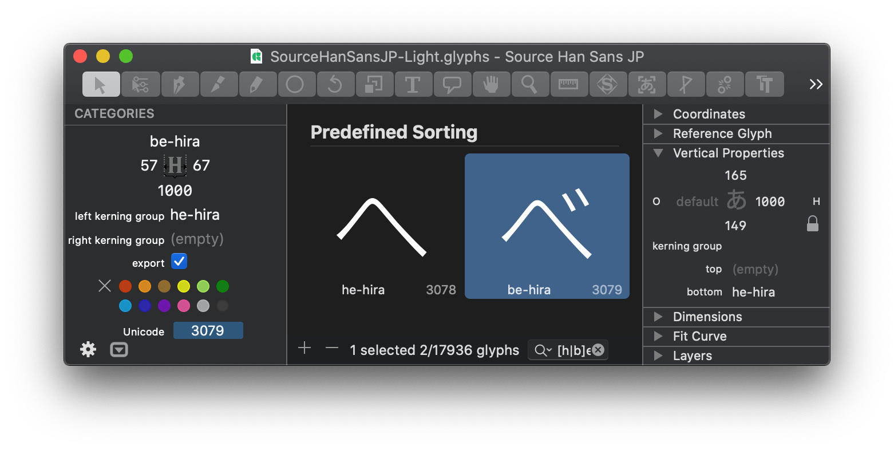

# VerticalGlyphProperties.glyphsPalette

A Glyphs palette plugin which allows you to view/edit vertical kerning groups and glyph metrics.

## Installation

1. Download the ZIP archive and unpack it, or clone the repository.
2. Double-click the `.glyphsPalette` in the Finder. Confirm the dialog that appears in Glyphs.
3. Restart Glyphs.

## Usage

1. Select one or more glyphs in the window.
2. Make sure the vertical glyph metrics are shown for the selected glyph.
3. Try setting a vertical kerning group.
4. Make sure the kerning groups are set as intended by opening the glyphs in a new tab.
5. While not recommended, vertical glyphs metrics become editable if you click on the lock icon.

As a bonus, this plugin adds the missing table columns for the following properties: *Top Kerning Group, Bottom Kerning Group* and *Vertical Origin.* Switch to the list mode, right click on the table column and have them enabled when you need to have a glance at those values.

## Requirements

Tested with Glyphs 2.6.2 and Glyphs 3.1.1 on macOS 10.15.

## License

Apache License 2.0
